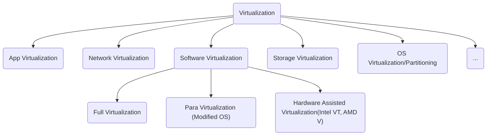
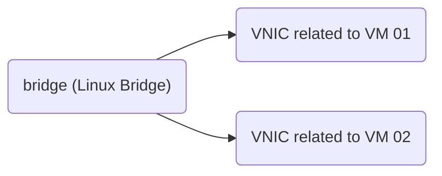

# Topic 330: Virtualization

## 330.1 Virtualization Concepts and Theory

**Weight: 8**

Description: Candidates should know and understand the general concepts, theory and terminology of Virtualization. This includes Xen, KVM and libvirt terminology.

Key Knowledge Areas:

- Terminology
- Pros and Cons of Virtualization
- Variations of Virtual Machine Monitors
- Migration of Physical to Virtual Machines
- Migration of Virtual Machines between Host systems
- Cloud Computing

The following is a partial list of the used files, terms and utilities:

- [x] Hypervisor
- [x] Hardware Virtual Machine (HVM)
- [x] Paravirtualization (PV)
- [x] Container Virtualization
- [x] Emulation and Simulation
- [x] CPU flags
- [x] /proc/cpuinfo
- [x] Migration (P2V, V2V)
- [x] IaaS, PaaS, SaaS
---

### Virtualization Concepts

Virtualization in general has a lack of faces:



**Protection Ring**
- Ring -1/0/1/2/3 from Most to Least Privileged
  - -1: Used only on HVM/HAV - Normally is where your hypervisor will sit on.
  - 0: Kernel Mode/Land
  - 1: Not Used on normal OS, but used by Guest OS on Full Virtualization
  - 2: Not Used
  - 3: User Mode/Land, Application level

#### Types of virtualization

- **Hypervisor or Virtual Machine Monitor**
<p>The system that runs the virtualization software ( KVM, QEMU, Xen, VMWare, VirtualBox). This is a layer of abstration between the   underlying hardware and the operational system running on top of it (Guest OS). Always running on Ring 0 near the Kernel.</p>

- **Hardware Virtual Machine or Hardware Assisted Virtualization (HVM/HAV) NOT FINISHED**
<p>This is a extension for the full virtualization. Created by Intel and AMD with the names **Virtualization Technology (VT)** and **Secure Virtual Machine (SMV)**, allwing the VMM/hypervisor to run a Guest OS that expects to run in kernel mode (Ring 0).</p>
<br>

- **Full virtualization**
<p>In this virtualization type all privileged instructions are emulated to overcome the limitation arising from the Guest OS runing on Ring 1 and Hypervisor/VMM running on Ring 0. It relies on techniques, such as binary translation where the call is rewritten to run in Ring 0. With full virtualization one can run different Guest OS, Linux, Unix and Windows with the downside been a fall in performance.</p>
<br>

- **Paravirtualization**
<p>This type of virtualization doesn't use  **system calls emulation interfaces**, normally seen when running different os from the Host. Because this layer is not present, alternative operational systems cannot be virtualized or acommodated. Even though all virtual machines/**container** are running under the same Kernel, they have their own filesystems, memory, processes, devices, etc. Despite not been able to run different operational systems, the user of this kind of virtualization have more performance then a Full Virtualization. Paravirtualization Guest OS runs in Ring 0 doing hypercalls to the virtualization layer on the same ring.</p>


- Container Virtualization
- **Emulation and Simulation**
<p>Emulation and Simulation are two different approach for dealing with virtualization.

QEMU can act like a Emulator when doing binary translation for running OS systems aimed for different hardware architectures, for example: ARM in x86. This binary translator is called Tiny Code Generator (TCG),a Just-In-Time compiler.  

When acting like a simulator
</p>

### CPU Support for (Full) Virtualization

- CPU Flags
For a computer support a full virtualization its hardware needs to have some specific flags defined on the CPU: VT-x for Intel, AMD-V for AMD.
```sh
grep --color -Ew 'svm|vmx|lm' /proc/cpuinfo
```
The expression used above means that we are looking for Virtualization suport (svm,vmx) and 64bit support (lm), being:

- svm: AMD virtualization support
- vmx: Intel virtualization support
- lm: x86_64 bits. From the source (include/asm/cpufeatures.h) "Long Mode (x86-64, 64-bit support)"


### Migrations (P2V and V2V)

virt-v2v
virt-p2v

### IaaS, PaaS and SaaS

- **IaaS**
**_Infrastructure as a Service_**: This kind of cloud solution isolate the Infrastructure layer, meaning hardware. The user only deals with OS installation but not with the type of hardware been used, allowing only a definition of the amount of VirtualCPUs, Memory and Disk Space to be defined.

- PaaS
**_Platform as a Service_**: This type of cloud solution isolate not only the infrastructure but also the OS level, letting the user interaction limited to a stack of services being used. For example cloud services on AWS and GCP.

- SaaS
**_Software as a Service_**: The last typy only allows the user to interact with a service, like gmail, dropbox, facebook, paypal.

## 330.2 Xen

**Weight: 9**

Description: Candidates should be able to install, configure, maintain, migrate and troubleshoot Xen installations. The focus is on Xen version 4.x.

Key Knowledge Areas:

- Xen architecture, networking and storage
- Xen configuration
- Xen utilities
- Troubleshooting Xen installations
- Basic knowledge of XAPI
- Awareness of XenStore
- Awareness of Xen Boot Parameters
- Awareness of the xm utility

Terms and Utilities:

- [ ] Domain0 (Dom0), DomainU (DomU)
- [ ] PV-DomU, HVM-DomU
- [ ] /etc/xen/
- [ ] xl
- [ ] xl.cfg
- [ ] xl.conf
- [ ] xe
- [ ] xentop

---

Dom0 - Default have drivers
DomU - Guests

configs in /etc/xen/
/etc/xen/xlubuntu01.hvm -> Full-virtualization
/etc/xen/xlubuntu02.pvlinux -> Paravirtualization

Diff:
```
* Do tipo HVM:
builder = "hvm"

----------------------------------

* Do tipo Paravirtualizado:
# Kernel image to boot
kernel = "/boot/vmlinuz"

# Ramdisk (optional)
#ramdisk = "/boot/initrd.gz"

# Kernel command line options
extra = "root=/dev/xvda1"

```

Network:
```
eth0 → vif4.0 → eth0(Dom-4)
```
Max -> 00:16:3e:xx:xx:xx

/etc/xen/xl.conf -> all Guests
```
vif=[ 'bridge=xenbr0' ]
---
# OVS
vif.default.script="vif-openvswitch"
vif.default.bridge="ovsbr0"
```

Storage
Use LVM but can use images like raw and qcow2
LVM is preferable

```
disk = [ 'phy:/dev/vg/guest-volume,raw,xvda,rw' ]
```

Commands:

xl create domU_CONFIG
xl create hvm.cfg 'cpus="0-3"; pci=["01:05.1","01:02.2"]'
xl config-update domid [configfile]
xl console domain-id
xl destroy domain-id
xl pause domain-id
xl reboot domain-id
xl restore domain-id
xl shutdown domain-id
xl list


xentop
xenpm

XAPI -> xe command

xe vm-start vm=<TARGET>
xe vm-destroy uuid=<TARGET>
xe sr-create name-label=<> physical-size=<> type=<> content-type=<> device-config:<config_name>=<>
xe vm-install
xe vif-create

XenStore(xenstored)
xenstore-ls -f
xenstore-write

## 330.3 KVM

**Weight: 9**

Description: Candidates should be able to install, configure, maintain, migrate and troubleshoot KVM installations.

Key Knowledge Areas:

- KVM architecture, networking and storage
- KVM configuration
- KVM utilities
- Troubleshooting KVM installations

Terms and Utilities:

- [x] Kernel modules: kvm, kvm-intel and kvm-amd
- [ ] /etc/kvm/
- [ ] /dev/kvm
- [ ] kvm
- [ ] KVM monitor
- [ ] qemu
- [ ] qemu-img
---

### OpenSuse KVM installation

In order to install KVM with QEMU and libvirt on OpenSuse 15.1 you will need to install two patterns:

- **kvm_server** - Will install **KVM** and **QEMU** Tools
- **kvm_tools** - Will install **libvirt** tools like **virsh**

 ```SHELL
$ sudo zypper in -t pattern kvm_server kvm_tools
 ```

### CentOS 7 installation

With CentOS you can install individual packages or use package groups like following:

```SHELL
# yum groupinstall "Virtualization Tools" --optional
```

This command will install libvirt, qemu-kvm, qemu-img and qemu-kvm-tools (--optional).

### Network

Virtual network switch known as the **bridge**, is the component responsible to connect virtual ports to which the interfaces to virtual machines are attached.



A Virtual Interface can be of two types: **TUN** or **TAP**. A **TUN** interface which stands for "tunnel", simulates a network layer device (L3) dealing with IP packages. A **TAP** simulates a link layer device and it operates at layer 2, dealing with Ethernet frames.


### Storage

Creating a disk with dd:
```sh
dd if=/dev/zero of=<PATH>/disk2.img bs=1G count=10          # Preallocated
dd if=/dev/zero of=<PATH>/disk3.img bs=1G seek=10 count=0   # Thin-provisioned
```

Attaching disk to a running VM/Domain:
```SHELL
sudo virsh attach-disk DOMAIN_NAME <PATH>/disk2.img vdb --live --config
```
Where:
- **--live**: apply configuration to the running vm
- **--config**: update the xml

Check the applied configuration:

```SHELL
sudo virsh domblklist DOMAIN_NAME
~$ sudo virsh domblklist centos7-01
 Target   Source
------------------------------------------------------------
 vda      /var/lib/libvirt/images/centos7-01-1.qcow2
 vdb      /home/jrballot/Documents/LPIC-304/dbvm_disk2.img
 hda      -
```

##### Managing Storage

When dealing with a pool of storage libvirt helps with a extensive list of types:
- **dir**: Store disk on directory of your filesystem
- **disk**: use physical hard disk to create virtual disk
- **fs**: Uses pre-formatted partitions to store virtual disks
- **netfs**: Uses network-shared storage like NFS to store virtual disks
- **gluster**: Allows using the gluster filesystem to store virtual disks
- **iscsi**: Uses network-shared ISCSI storage to store virtual disks
- **scsi**: Uses local SCSI storage to store virtual disks
- **lvm**: Depends on LVM volume groups to store virtual disks
- **rbd**: Allows connecting ceph storage for virtual disks

Creating a pool:

```SHELL
sudo virsh pool-define-as dedicated_storage dir - - -  "/opt/pool/"
sudo virsh pool-list --all
sudo virsh pool-build dedicated_storage
sudo virsh pool-start dedicated_storage
```

Creating a volume from pool:

```SHELL
sudo virsh vol-list dedicated_storage
sudo virsh vol-create-as dedicated_storage vm_vol1 10G
sudo virsh vol-info --pool dedicated_storage vm_vol1
sudo virsh vol-delete --pool dedicated_storage vm_vol1
```

##### Setting up a Bridge and TAP interface

For setting a bridge adapter we'll use brctl command from bridge-utils package.

```SHELL
sudo brctl show
sudo brctl addbr tester
sudo ip link show tester
sudo ip tuntap add dev vm-vnic mode tap
sudo ip link show vm-vnic
sudo brctl addif tester vm-vnic
sudo brctl show

# Deleting this bridge

sudo brctl delif tester vm-vnic
sudo ip tuntap del dev vm-vnic mode tap
sudo brctl delbr tester
```

#### Virtual Networking using libvirt

When using libvirt for managing virtual networks we have a set of options to use:

 - Isoleted virtual network
 - Routed virtual network
 - NATed virtual network
 - Bridge network using physical NIC, CLAN interface bond interface and bonded VLAN interface
 - MacVTap
 - PCI passthrough NPIV
 - OVS

**Creating a Isolated virtual network**

```sh
$ vim isolated.xml
<network>
  <name>isolated</name>  # tag must be closed in the same line
</network>
$ sudo virsh net-define isolated.xml
$ sudo virsh net-start isolated
$ ifconfig / ip a / brctl show  # use one of to check if bridge exists
```
**Attaching interface to a instance**

```sh
LPIC-304$ sudo virsh domiflist debian10-01
 Interface   Type      Source    Model   MAC
------------------------------------------------------------
 -           network   default   e1000   52:54:00:c3:28:f8

LPIC-304$ sudo virsh start debian10-01    
Domain debian10-01 started
LPIC-304$ sudo virsh domiflist debian10-01
Interface   Type      Source    Model   MAC
------------------------------------------------------------
vnet0       network   default   e1000   52:54:00:c3:28:f8


LPIC-304$ sudo virsh attach-interface --domain debian10-01 --source isolated --type network --model virtio --config --live
Interface attached successfully
LPIC-304$ sudo virsh domiflist debian10-01
 Interface   Type      Source     Model    MAC
--------------------------------------------------------------
 vnet0       network   default    e1000    52:54:00:c3:28:f8
 vnet1       network   isolated   virtio   52:54:00:9b:c8:ef

```

The line **sudo virsh attach-interface --domain debian10-01 --source isolated --type network --model virtio --config --live** as some interesting options:

- --domain debian10-01: Identify the vm to attach a interface
- --source isolated: Specify the network we are attaching this interface to.
- --type network: Network interface type (netwoirk for libvirt virtual network)
  - bridge: indicate connection via a bridge device on the host
  - direct: indicate connection directly to one of the host's network interfaces or bridges
  - hostdev: indicate connection using a passthrough of PCI device on the host.
- --model: network device model (????)
- --config: affect the next startup of a pesistent domain
- --live: affect a running domain


## 330.4 Other Virtualization Solutions

**Weight: 3**

Description: Candidates should have some basic knowledge and experience with alternatives to Xen and KVM.

Key Knowledge Areas:

- Basic knowledge of OpenVZ and LXC
- Awareness of other virtualization technologies
- Basic knowledge of virtualization provisioning tools

Terms and Utilities:

- [ ] OpenVZ
- [ ] VirtualBox
- [ ] LXC
- [x] docker
- [x] packer
- [x] vagrant
---

### OpenVZ

### LXC


## 330.5 Libvirt and Related Tools

**Weight: 5**

Description: Candidates should have basic knowledge and experience with the libvirt library and commonly available tools.

Key Knowledge Areas:

- libvirt architecture, networking and storage
- Basic technical knowledge of libvirt and virsh
- Awareness of oVirt

Terms and Utilities:

- [x] libvirtd
- [ ] /etc/libvirt/
- [x] virsh
- [ ] oVirt
---

### Libvirt architecture, networking and storage


### Architecture


### Networking

Every standard libvirt installation will have a NAT based connection. This is the "default" configuration. By running the command _virsh net-list --all_ the list of network will be displayed.

If any definition or network is missed you can reload from the XML file.

```SH
# virsh net-define /usr/share/libvirt/networks/default.xml
# virsh net-autostart default
# virsh net-start default
```

The XML file, default.xml, contains the definition for the default NAT network. In this file you will see the bridge interface, gateway ip addess and dhcp range.

```SH
# cat /usr/share/libvirt/networks/default.xml
<network>
  <name>default</name>
  <bridge name="virbr0"/>
  <forward/>
  <ip address="192.168.122.1" netmask="255.255.255.0">
    <dhcp>
      <range start="192.168.122.2" end="192.168.122.254"/>
    </dhcp>
  </ip>
</network>

```
...

### Storage

### OpenSuse/CentOS libvirt installations

Following the instructions in the previous chapter you should have libvirt installed. Otherwise install the pattern **kvm_tools** for OpenSuse or the **Virtualization Tools** for RedHat based systems.

### Managing libvirtd

```SH
$ sudo systemctl status libvirtd
$ sudo systemctl stop libvirtd
$ sudo systemctl start libvirtd
$ sudo systemctl enable libvirtd

```
 > WARNING: You should not run **libvirtd** and **xendomains** in parallel, they execute the same task and can interfere with one another.


### Running a VM

 Using **virt-install** to install

 Options:
 - --name : vm name
 - --memory : amount of memory in MiB

 Guest storage:
 - --disk : storage configuration details, set to **none** for no disk space on vm
 - --filesystem : path of the file system for the vm

 Instalation method:
 - --location : location of instalation media
 - --cdrom : path for the ISO image, **CANNOT BE** a real CD/DVD-ROM device
 - --pxe : PXE Boot
 - --import : import a existing disk image
 - --boot : define boot sequence

 Creating a VM

 ```SHELL
 # virt-install --name guest-01 --memory 256Mib \
   --vcpus 1 --disk size=8 --cdrom=$PATH/OS.iso --os-variant rhel7
 ```

This command will popup virt-viewer with the loaded iso.

After finishing the installation the vm will be ready for use. The disk will be of 8GiB with 256Mib RAM and a NAT network.

### Virsh utility


```SH
# virsh list
# virsh list --all
```

#### Clonning VM

When clonning a VM  ones can use virt-clone with the option --auto-clone.

```SH
sudo virt-clone --original=<original-domain> --name=<new-domain> --auto-clone
```


## 330.6 Cloud Management Tools

**Weight: 2**

Description: Candidates should have basic feature knowledge of commonly available cloud management tools.

Key Knowledge Areas:

- Basic feature knowledge of OpenStack and CloudStack
- Awareness of Eucalyptus and OpenNebula

Terms and Utilities:

- [x] OpenStack
- [ ] CloudStack
- [x] Eucalyptus
- [ ] OpenNebula
---
