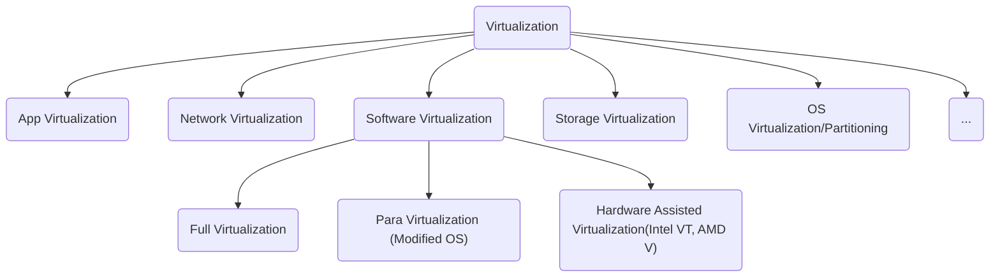

# Topic 330: Virtualization

## 330.1 Virtualization Concepts and Theory

**Weight: 8**

Description: Candidates should know and understand the general concepts, theory and terminology of Virtualization. This includes Xen, KVM and libvirt terminology.

Key Knowledge Areas:

- Terminology
- Pros and Cons of Virtualization
- Variations of Virtual Machine Monitors
- Migration of Physical to Virtual Machines
- Migration of Virtual Machines between Host systems
- Cloud Computing

The following is a partial list of the used files, terms and utilities:

- Hypervisor
- Hardware Virtual Machine (HVM)
- Paravirtualization (PV)
- Container Virtualization
- Emulation and Simulation
- CPU flags
- /proc/cpuinfo
- Migration (P2V, V2V)
- IaaS, PaaS, SaaS
---

### Virtualization Concepts

Virtualization in general has a lack of faces:



**Protection Ring**
- Ring -1/0/1/2/3 from Most to Least Privileged
  - -1: Used only on HVM/HAV
  - 0: Kernel Mode/Land
  - 1: Not Used on normal OS, but used by Guest OS on Full Virtualization
  - 2: Not Used
  - 3: User Mode/Land, Application level

#### Types of virtualization

- **Hypervisor or Virtual Machine Monitor**
<p>The system that runs the virtualization software ( KVM, QEMU, Xen, VMWare, VirtualBox). This is a layer of abstration between the   underlying hardware and the operational system running on top of it (Guest OS). Always running on Ring 0 near the Kernel.</p>

- **Hardware Virtual Machine or Hardware Assisted Virtualization (HVM/HAV) NOT FINISHED**
<p>This is a extension for the full virtualization. Created by Intel and AMD with the names **Virtualization Technology (VT)** and **Secure Virtual Machine (SMV)**, allwing the VMM/hypervisor to run a Guest OS that expects to run in kernel mode (Ring 0).</p>
<br>

- **Full virtualization**
<p>In this virtualization type all privileged instructions are emulated to overcome the limitation arising from the Guest OS runing on Ring 1 and Hypervisor/VMM running on Ring 0. It relies on techniques, such as binary translation where the call is rewritten to run in Ring 0. With full virtualization one can run different Guest OS, Linux, Unix and Windows with the downside been a fall in performance.</p>
<br>

- **Paravirtualization**
<p>This type of virtualization doesn't use  **system calls emulation interfaces**, normally seen when running different os from the Host. Because this layer is not present, alternative operational systems cannot be virtualized or acommodated. Even though all virtual machines/**container** are running under the same Kernel, they have their own filesystems, memory, processes, devices, etc. Despite not been able to run different operational systems, the user of this kind of virtualization have more performance then a Full Virtualization. Paravirtualization Guest OS runs in Ring 0 doing hypercalls to the virtualization layer on the same ring.</p>


- Container Virtualization
- **Emulation and Simulation**
<p>Emulation and Simulation are two different approach for dealing with virtualization.

QEMU can act like a Emulator when doing binary translation for running OS systems aimed for different hardware architectures, for example: ARM in x86. This binary translator is called Tiny Code Generator (TCG),a Just-In-Time compiler.  

When acting like a simulator
</p>

### CPU Support for (Full) Virtualization

- CPU Flags
For a computer support a full virtualization its hardware needs to have some specific flags defined on the CPU: VT-x for Intel, AMD-V for AMD.
```sh
grep --color -Ew 'svm|vmx|lm' /proc/cpuinfo
```
The expression used above means that we are looking for Virtualization suport (svm,vmx) and 64bit support (lm), being:

- svm: AMD virtualization support
- vmx: Intel virtualization support
- lm: x86_64 bits. From the source (include/asm/cpufeatures.h) "Long Mode (x86-64, 64-bit support)"


### Migrations (P2V and V2V)

virt-v2v
virt-p2v

### IaaS, PaaS and SaaS

- **IaaS**
**_Infrastructure as a Service_**: This kind of cloud solution isolate the Infrastructure layer, meaning hardware. The user only deals with OS installation but not with the type of hardware been used, allowing only a definition of the amount of VirtualCPUs, Memory and Disk Space to be defined.

- PaaS
**_Platform as a Service_**: This type of cloud solution isolate not only the infrastructure but also the OS level, letting the user interaction limited to a stack of services being used. For example cloud services on AWS and GCP.

- SaaS
**_Software as a Service_**: The last typy only allows the user to interact with a service, like gmail, dropbox, facebook, paypal.

## 330.2 Xen

**Weight: 9**

Description: Candidates should be able to install, configure, maintain, migrate and troubleshoot Xen installations. The focus is on Xen version 4.x.

Key Knowledge Areas:

- Xen architecture, networking and storage
- Xen configuration
- Xen utilities
- Troubleshooting Xen installations
- Basic knowledge of XAPI
- Awareness of XenStore
- Awareness of Xen Boot Parameters
- Awareness of the xm utility

Terms and Utilities:

- Domain0 (Dom0), DomainU (DomU)
- PV-DomU, HVM-DomU
- /etc/xen/
- xl
- xl.cfg
- xl.conf
- xe
- xentop

---
## 330.3 KVM

**Weight: 9**

Description: Candidates should be able to install, configure, maintain, migrate and troubleshoot KVM installations.

Key Knowledge Areas:

- KVM architecture, networking and storage
- KVM configuration
- KVM utilities
- Troubleshooting KVM installations

Terms and Utilities:

- Kernel modules: kvm, kvm-intel and kvm-amd
- /etc/kvm/
- /dev/kvm
- kvm
- KVM monitor
- qemu
- qemu-img
---

### OpenSuse KVM installation

In order to install KVM with QEMU and libvirt on OpenSuse 15.1 you will need to install two patterns:

- **kvm_server** - Will install **KVM** and **QEMU** Tools
- **kvm_tools** - Will install **libvirt** tools like **virsh**

 ```SHELL
$ sudo zypper in -t pattern kvm_server kvm_tools
 ```

### CentOS 7 installation

With CentOS you can install individual packages or use package groups like following:

```SHELL
# yum groupinstall "Virtualization Tools" --optional
```

This command will install libvirt, qemu-kvm, qemu-img and qemu-kvm-tools (--optional).


## 330.4 Other Virtualization Solutions

**Weight: 3**

Description: Candidates should have some basic knowledge and experience with alternatives to Xen and KVM.

Key Knowledge Areas:

- Basic knowledge of OpenVZ and LXC
- Awareness of other virtualization technologies
- Basic knowledge of virtualization provisioning tools

Terms and Utilities:

- OpenVZ
- VirtualBox
- LXC
- docker
- packer
- vagrant


## 330.5 Libvirt and Related Tools

**Weight: 5**

Description: Candidates should have basic knowledge and experience with the libvirt library and commonly available tools.

Key Knowledge Areas:

- libvirt architecture, networking and storage
- Basic technical knowledge of libvirt and virsh
- Awareness of oVirt

Terms and Utilities:

- libvirtd
- /etc/libvirt/
- virsh
- oVirt
---

## Libvirt architecture, networking and storage

### Architecture

### Networking

Every standard libvirt installation will have a NAT based connection. This is the "default" configuration. By running the command _virsh net-list --all_ the list of network will be displayed.

If any definition or network is missed you can reload from the XML file.

```SH
# virsh net-define /usr/share/libvirt/networks/default.xml
# virsh net-autostart default
# virsh net-start default
```

The XML file, default.xml, contains the definition for the default NAT network. In this file you will see the bridge interface, gateway ip addess and dhcp range.

```SH
# cat /usr/share/libvirt/networks/default.xml
<network>
  <name>default</name>
  <bridge name="virbr0"/>
  <forward/>
  <ip address="192.168.122.1" netmask="255.255.255.0">
    <dhcp>
      <range start="192.168.122.2" end="192.168.122.254"/>
    </dhcp>
  </ip>
</network>

```
...

### Storage

### OpenSuse/CentOS libvirt installations

Following the instructions in the previous chapter you should have libvirt installed. Otherwise install the pattern **kvm_tools** for OpenSuse or the **Virtualization Tools** for RedHat based systems.

### Managing libvirtd

```SH
$ sudo systemctl status libvirtd
$ sudo systemctl stop libvirtd
$ sudo systemctl start libvirtd
$ sudo systemctl enable libvirtd

```
 > WARNING: You should not run **libvirtd** and **xendomains** in parallel, they execute the same task and can interfere with one another.


### Running a VM

 Using **virt-install** to install

 Options:
 - --name : vm name
 - --memory : amount of memory in MiB

 Guest storage:
 - --disk : storage configuration details, set to **none** for no disk space on vm
 - --filesystem : path of the file system for the vm

 Instalation method:
 - --location : location of instalation media
 - --cdrom : path for the ISO image, **CANNOT BE** a real CD/DVD-ROM device
 - --pxe : PXE Boot
 - --import : import a existing disk image
 - --boot : define boot sequence

 Creating a VM

 ```SHELL
 # virt-install --name guest-01 --memory 256Mib \
   --vcpus 1 --disk size=8 --cdrom=$PATH/OS.iso --os-variant rhel7
 ```

This command will popup virt-viewer with the loaded iso.

After finishing the installation the vm will be ready for use. The disk will be of 8GiB with 256Mib RAM and a NAT network.

### Virsh utility


```SH
# virsh list
# virsh list --all
```

#### Clonning VM

When clonning a VM  ones can use virt-clone with the option --auto-clone.

```SH
$ sudo virt-clone --original=<original-domain> --name=<new-domain> --auto-clone
```


## 330.6 Cloud Management Tools

**Weight: 2**

Description: Candidates should have basic feature knowledge of commonly available cloud management tools.

Key Knowledge Areas:

- Basic feature knowledge of OpenStack and CloudStack
- Awareness of Eucalyptus and OpenNebula

Terms and Utilities:

- OpenStack
- CloudStack
- Eucalyptus
- OpenNebula
---
